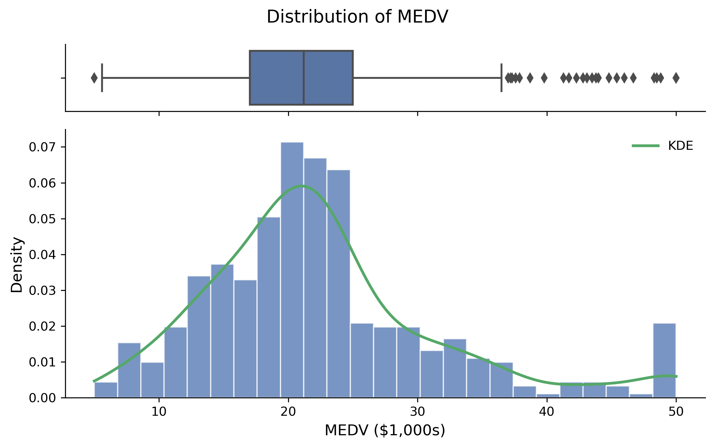
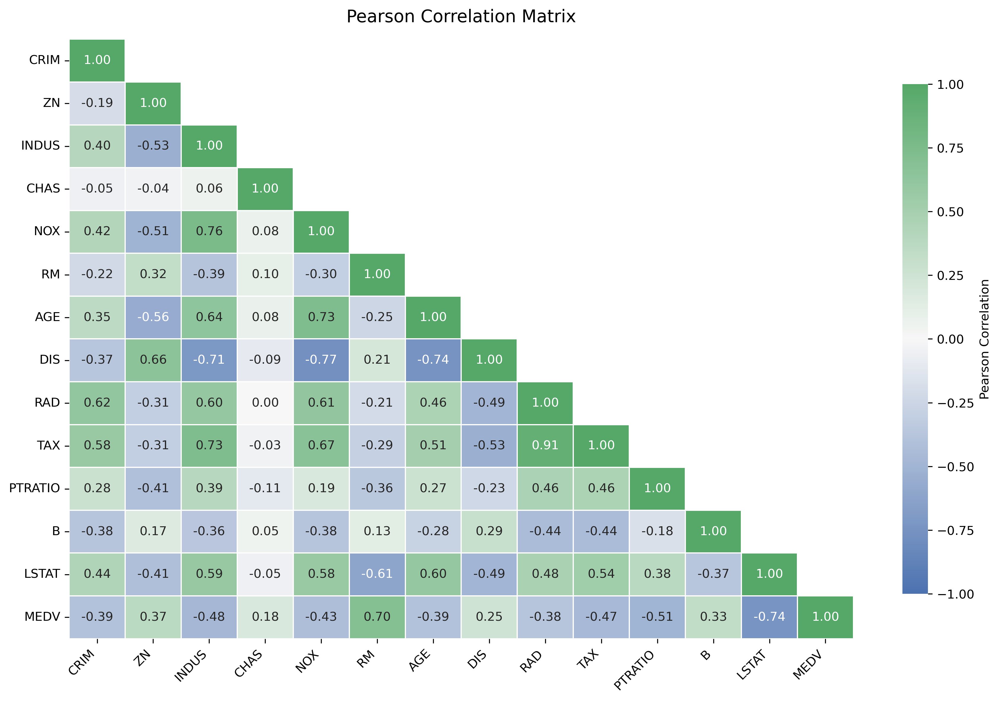
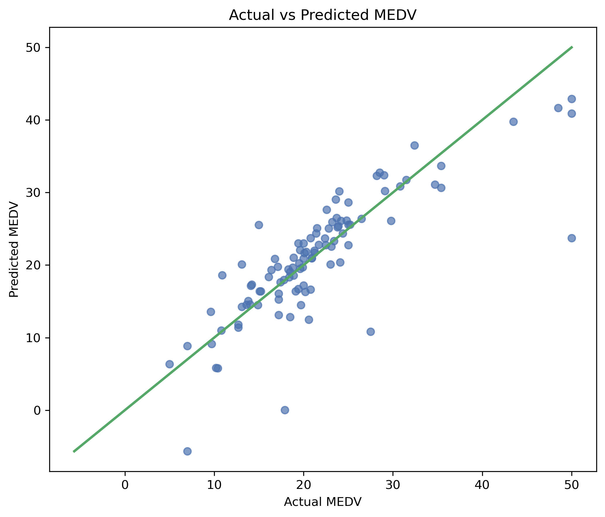
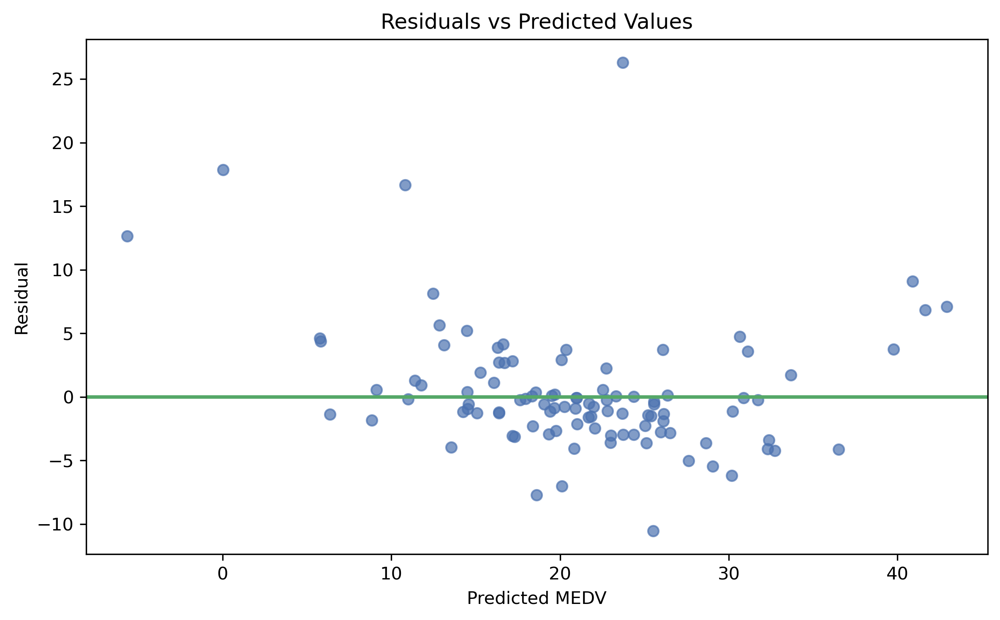
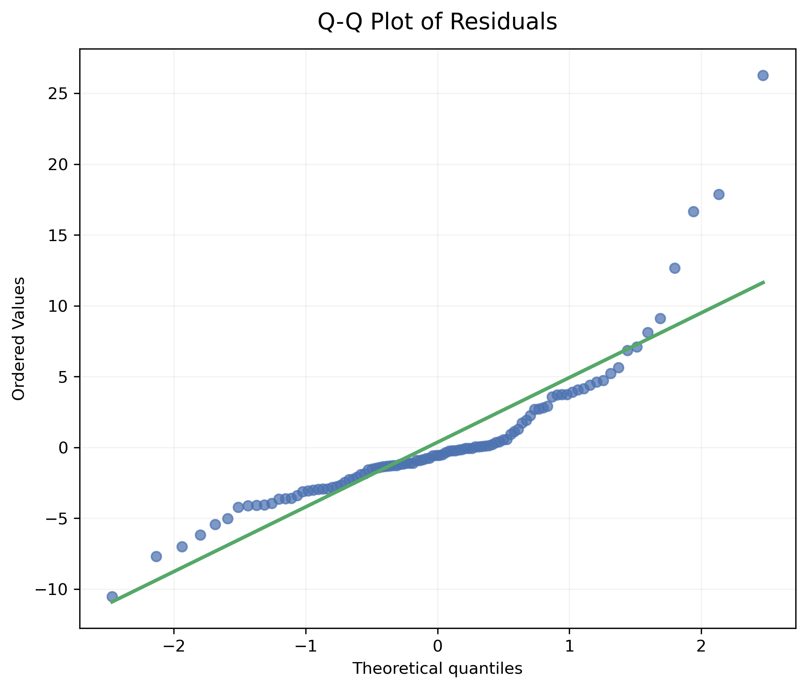

# Boston Housing Price Prediction with Linear Regression

An end-to-end regression project built around the historical Boston Housing dataset. I use Linear Regression as an interpretable baseline, then look beyond a single performance score by checking data quality, residual behavior, multicollinearity, and cross-validation.

---

## Learning Resources

Alongside the main notebook, this repository includes two focused guides that connect the theory directly to the project:

- [Linear Regression Tutorial](docs/linear_regression_tutorial.md)
- [Statistics for Regression](docs/statistics_for_regression.md)
- [Jupyter Notebook](notebooks/boston_housing_linear_regression.ipynb)

---

## 1. Project Overview

The goal is to predict `MEDV`, the median value of owner-occupied homes in Boston-area towns, from 13 input features.

Because `MEDV` is continuous, this is a supervised regression problem. I start with Linear Regression because it provides a transparent baseline: the model is easy to inspect, the coefficients are interpretable, and its limitations are useful to diagnose before moving to more flexible methods.

---

## Quick Results

| Metric | Result |
|---|---:|
| Test R² | 0.659 |
| Test RMSE | 5.00 |
| 5-Fold CV R² | 0.708 |
| 5-Fold CV RMSE | 4.912 |

The held-out test set and cross-validation tell a similar story: Linear Regression is a useful baseline, but performance varies across splits and there is still meaningful prediction error. Reporting both gives a more balanced view of generalization than relying on a single score.

---

## 2. Business / Problem Statement

Rather than treating this as a pure prediction exercise, I use the baseline to answer three practical questions:

1. Which variables have the clearest linear relationships with housing values?
2. How well does the model generalize to unseen observations?
3. What do the residuals and model diagnostics tell us about the limits of a linear approach?

The emphasis is therefore split between predictive performance and statistical diagnostics.

---

## 3. Dataset

The dataset contains:

- **506 observations**
- **13 input features**
- **1 target variable: `MEDV`**

The records describe Boston-area suburbs or towns and come from historical data collected around 1970.

The initial data-quality review found:

- no duplicate rows,
- missing values in several predictor columns,
- no missing values in `MEDV`,
- and **120 missing values** across the predictors.

Missing values appear in:

- `CRIM`
- `ZN`
- `INDUS`
- `CHAS`
- `AGE`
- `LSTAT`

Each of these columns contains 20 missing observations.

> **Responsible-use note**
>
> This is a historical educational dataset. One of the original features (`B`) is race-derived, and the observations come from 1970-era data. I use the dataset here to study regression workflow and diagnostics, not as a model for modern housing valuation, lending, or policy decisions.

---

## 4. Features

| Feature | Description |
|---|---|
| `CRIM` | Per-capita crime rate by town |
| `ZN` | Proportion of residential land zoned for large lots |
| `INDUS` | Proportion of non-retail business acres per town |
| `CHAS` | Charles River dummy variable |
| `NOX` | Nitric oxide concentration |
| `RM` | Average number of rooms per dwelling |
| `AGE` | Proportion of owner-occupied units built before 1940 |
| `DIS` | Weighted distance to employment centers |
| `RAD` | Accessibility index to radial highways |
| `TAX` | Property-tax rate |
| `PTRATIO` | Pupil-teacher ratio |
| `B` | Historical race-derived feature from the original dataset |
| `LSTAT` | Percentage of lower-status population |
| `MEDV` | Median value of owner-occupied homes in \$1,000s |

---

## 5. Data Preprocessing

I split the data before fitting any data-dependent preprocessing. Missing values are handled inside a Scikit-learn `Pipeline` with:

```python
SimpleImputer(strategy="median")
```

This means the imputer learns replacement values from the training data rather than from the full dataset, which helps prevent data leakage.

I do not scale the features for the baseline Ordinary Least Squares model. Scaling is not required for Linear Regression predictions, and keeping the original units makes the raw coefficients easier to interpret.

---

## 6. Exploratory Data Analysis (EDA)

The exploratory analysis covers:

- dataset structure and data types,
- missing values,
- duplicate detection,
- target distribution,
- boxplot review,
- Pearson correlation,
- feature-vs-target scatter plots,
- and IQR-based outlier diagnostics.

A few patterns stand out:

- `RM` has a strong positive linear relationship with `MEDV`.
- `LSTAT` has a strong negative linear relationship with `MEDV`.
- Several observations sit exactly at `MEDV = 50`, so the upper end of the target should be interpreted cautiously.

Pearson correlation is used here because this first model focuses on linear relationships.

### Target Distribution

The target is not evenly distributed across its range. The cluster at `MEDV = 50` is especially important because it suggests an upper-end ceiling in the historical data.



### Correlation Analysis

The correlation matrix gives a quick view of the strongest linear relationships in the dataset. `RM` moves positively with `MEDV`, while `LSTAT` shows a strong negative relationship.



---

## 7. Statistical Analysis

The statistics in this project are used to support modeling decisions rather than as a separate checklist. The main topics are:

- mean and median,
- variance and standard deviation,
- Pearson correlation,
- covariance,
- distribution shape,
- outlier diagnostics,
- residual behavior,
- normality assessment,
- multicollinearity,
- and Variance Inflation Factor (VIF).

I use VIF as a diagnostic, not as an automatic rule for dropping features.

Some predictors, especially `RAD` and `TAX`, show notable multicollinearity. I keep them in the baseline so the first model remains transparent and reproducible, while interpreting their individual coefficients with caution.

---

## 8. Feature Engineering

I deliberately keep feature engineering light in this first pass. The aim is to understand what a straightforward linear baseline can do before adding transformations or more flexible models.

Outliers are flagged with the IQR rule, but they are not automatically clipped or removed. A statistically unusual observation is not necessarily an error, and removing it without investigation can distort the original relationships.

Potential extensions include:

- polynomial features,
- interaction terms,
- feature selection,
- robust transformations,
- and regularization.

---

## 9. Model

The baseline model is **Linear Regression**.

It represents the prediction as a linear combination of the input features:

```text
Prediction = Intercept + Coefficient₁ × Feature₁ + ... + Coefficientₙ × Featureₙ
```

The coefficients are estimated with Ordinary Least Squares (OLS), which minimizes the sum of squared residuals between observed and predicted values.

The fitted intercept and coefficients are read directly from the trained model rather than hard-coded.

---

## 10. Model Training

Training is intentionally simple:

1. median imputation,
2. Linear Regression.

Both steps live inside the same Scikit-learn `Pipeline`.

The data is split into training and test sets with a fixed random state for reproducibility. I also use shuffled 5-fold cross-validation so the assessment does not depend entirely on one train/test split.

---

## 11. Evaluation Metrics

I use several metrics because each one describes model error from a different angle:

- **MAE — Mean Absolute Error**
- **MSE — Mean Squared Error**
- **RMSE — Root Mean Squared Error**
- **R² — Coefficient of Determination**
- **Adjusted R²**

Lower values are better for MAE, MSE, and RMSE. Higher values are generally better for R² and Adjusted R².

The numerical metrics are paired with:

- actual vs. predicted values,
- residuals vs. predicted values,
- residual distribution,
- a Q-Q plot,
- and cross-validation results.

---

## 12. Results

### Test Set Performance

| Metric | Result |
|---|---:|
| MAE | ~3.15 |
| MSE | ~24.98 |
| RMSE | ~5.00 |
| R² | ~0.659 |
| Adjusted R² | ~0.609 |

On the held-out test set, the model explains about 66% of the variation in `MEDV`. The RMSE is roughly 5 target units, or about \$5,000 in the dataset's original scale.

### 5-Fold Cross-Validation

| Metric | Mean Result |
|---|---:|
| R² | ~0.708 |
| MAE | ~3.415 |
| RMSE | ~4.912 |

The cross-validation results are useful because they show how the same pipeline behaves across several different train-validation splits, rather than relying on a single split.

### Actual vs. Predicted Values

Most predictions follow the overall direction of the reference line, although the spread becomes more noticeable for some observations.



### Residual Diagnostics

The residual plot helps reveal structure that a single R² value cannot show. Ideally, residuals should be scattered around zero without a clear pattern.



The Q-Q plot adds another view of the residual distribution. Departures from the reference line, especially in the tails, indicate that the residuals are not perfectly normal.



---

## 13. Conclusion

Linear Regression turns out to be a useful baseline for this dataset, but not a complete solution.

It captures a meaningful share of the variation in housing values and remains easy to inspect. At the same time, the residual diagnostics, multicollinearity, and remaining prediction error show why the model should not be judged by R² alone.

The main value of this baseline is that it gives a clear reference point for the next models. Regularization, nonlinear features, and tree-based regressors can now be compared against something simple and interpretable.

---

## 14. Future Improvements

The next comparisons I would make are:

- Ridge Regression
- Lasso Regression
- Elastic Net
- Polynomial Regression
- Decision Tree Regression
- Random Forest Regression
- Gradient Boosting Regression
- hyperparameter tuning
- feature selection
- more detailed residual diagnostics
- comparison of multiple regression algorithms

I would also investigate the `MEDV = 50` ceiling and influential observations before drawing stronger conclusions from the model.

---

## 15. Technologies & Libraries

### Language

- Python

### Libraries

- NumPy
- Pandas
- Matplotlib
- Seaborn
- SciPy
- Scikit-learn
- Statsmodels

### Tools

- Jupyter Notebook
- Git
- GitHub
- Kaggle

---

## 16. Kaggle Notebook

The complete executable notebook is also available publicly on Kaggle.

**Kaggle Notebook:** [View on Kaggle](https://www.kaggle.com/code/anahitapouladi/boston-housing-prediction-linear-regression)

---

## Project Structure

```text
boston-housing-linear-regression/
│
├── README.md
├── .gitignore
├── requirements.txt
│
├── data/
│   └── HousingData.csv
│
├── notebooks/
│   └── boston_housing_linear_regression.ipynb
│
├── docs/
│   ├── linear_regression_tutorial.md
│   └── statistics_for_regression.md
│
└── images/
    ├── target_distribution.png
    ├── correlation_matrix.png
    ├── actual_vs_predicted.png
    ├── residuals_vs_predicted.png
    └── qq_plot_residuals.png
```

---

## What I Learned

The modeling code was the easy part of this project. The more useful lessons came from the decisions around it: where preprocessing belongs, how to avoid leakage, what residuals can reveal that a score cannot, and how to interpret a reasonable R² without overstating what the model has learned.

The project reinforced several habits I want to carry into later models:

- fit preprocessing only on training data,
- use cross-validation instead of trusting one split,
- treat VIF and outlier rules as diagnostics rather than automatic deletion rules,
- separate predictive performance from statistical assumptions,
- and document both the strengths and the limits of a model.

---

## Repository Contents

This repository includes:

- a reproducible Jupyter Notebook,
- the dataset used in the project,
- project dependencies,
- a Linear Regression tutorial,
- a statistics-for-regression guide,
- selected visualization assets,
- and the full project documentation.

You can start with the [Jupyter Notebook](notebooks/boston_housing_linear_regression.ipynb) for the complete workflow, or review the [Linear Regression Tutorial](docs/linear_regression_tutorial.md) first if you want the theory before the implementation.
