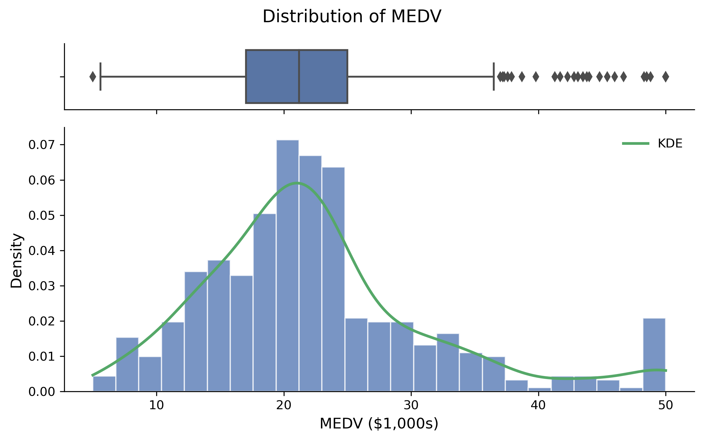
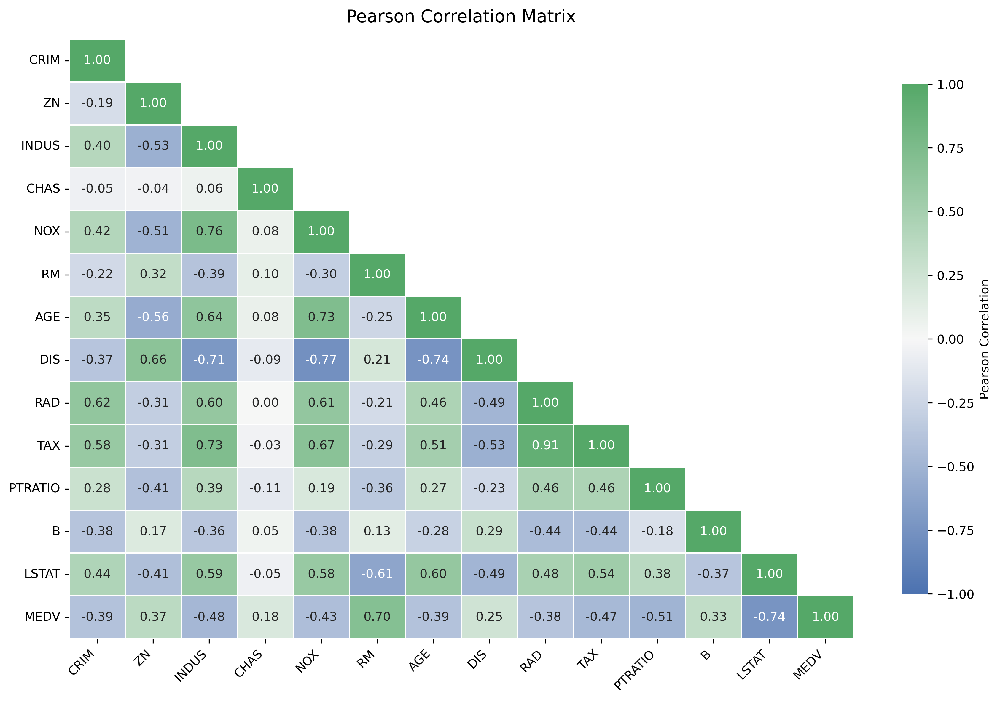
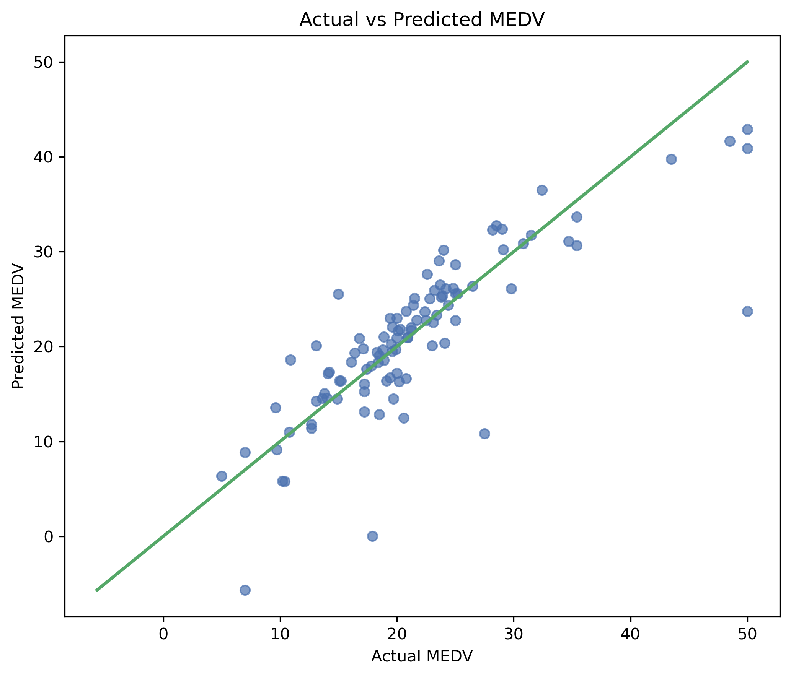
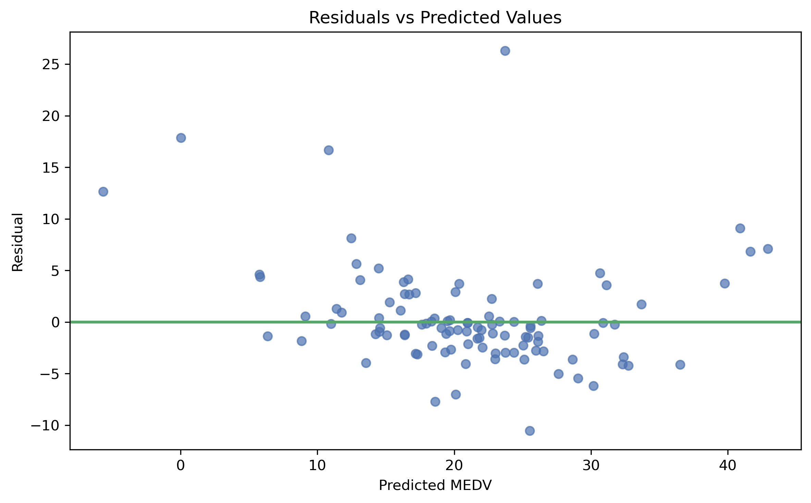
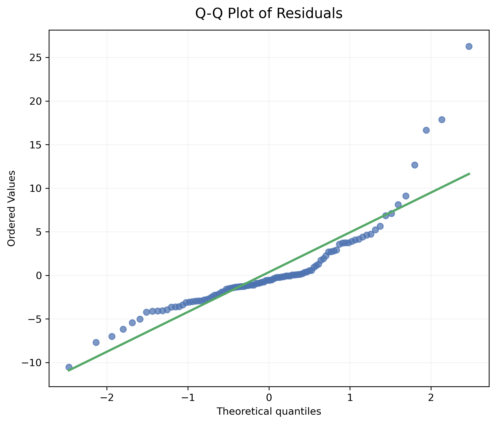

# Boston Housing Price Prediction with Linear Regression

An end-to-end regression project built around the historical Boston Housing dataset. I use Linear Regression as an interpretable baseline, then look beyond a single performance score by checking data quality, residual behavior, multicollinearity, and cross-validation.

## Project Links

- **GitHub Repository:** [boston-housing-linear-regression](https://github.com/Anahita-Pouladi/boston-housing-linear-regression)
- **Kaggle Notebook:** [Boston Housing Prediction | Linear Regression](https://www.kaggle.com/code/anahitapouladi/boston-housing-prediction-linear-regression)

---

## Learning Resources

Alongside the main notebook, this repository includes two focused guides that connect the theory directly to the project:

- [Linear Regression Tutorial](docs/linear_regression_tutorial.md)
- [Statistics for Regression](docs/statistics_for_regression.md)
- [Jupyter Notebook](notebooks/boston_housing_linear_regression.ipynb)

---

## 1. Project Overview

The goal is to predict `MEDV`, the median value of owner-occupied homes in Boston-area towns, from 13 input features.

Because `MEDV` is continuous, this is a supervised regression problem. I start with Linear Regression because it provides a transparent baseline: the model is easy to inspect, the coefficients are interpretable, and its limitations are useful to diagnose before moving to more flexible methods.

Rather than treating the project as a one-score prediction exercise, the focus is on the complete workflow:

- data quality and missing-value handling,
- leakage-safe preprocessing,
- exploratory and statistical analysis,
- multicollinearity diagnostics,
- residual analysis,
- held-out test evaluation,
- and cross-validation.

---

## Quick Results

| Metric | Result |
|---|---:|
| Test R² | 0.659 |
| Test RMSE | 5.00 |
| 5-Fold CV R² | 0.708 |
| 5-Fold CV RMSE | 4.912 |

Linear Regression is a useful baseline here, but performance varies across splits and there is still meaningful prediction error.

With these exact split settings, the held-out test set happens to match Fold 1, which is also the lowest-performing fold in this run. That is why the test R² of `0.659` sits below the 5-fold CV mean of `0.708`. Reporting both provides a more balanced view of generalization than relying on one score.

---

## 2. Problem Statement

The baseline is used to answer three practical questions:

1. Which variables show the clearest linear relationships with housing values?
2. How well does the model generalize to unseen observations?
3. What do residuals and model diagnostics reveal about the limitations of a linear approach?

The emphasis is therefore split between predictive performance and statistical diagnostics.

---

## 3. Dataset

The dataset contains:

- **506 observations**
- **13 input features**
- **1 target variable: `MEDV`**

The observations come from the historical Boston Housing dataset associated with Harrison and Rubinfeld's work and reflect 1970-era housing data.

The copy used in this project contains:

- no duplicate rows,
- missing values in several predictor columns,
- no missing values in `MEDV`,
- and **120 missing values** across the predictors.

Missing values appear in:

- `CRIM`
- `ZN`
- `INDUS`
- `CHAS`
- `AGE`
- `LSTAT`

Each of these columns contains 20 missing observations.

> **Data provenance note**
>
> The original historical dataset is complete. The missing values used in this project come from the Kaggle copy, so they are useful for practicing leakage-safe imputation but should not be interpreted as missingness in the original data collection.

### Dataset Source and License

- **Dataset:** [Boston Housing Dataset on Kaggle](https://www.kaggle.com/datasets/altavish/boston-housing-dataset)
- **License:** CC0: Public Domain
- **File used:** `data/HousingData.csv`
- **Original research:** Harrison, D. & Rubinfeld, D. L. (1978), *Hedonic Housing Prices and the Demand for Clean Air*
- **DOI:** https://doi.org/10.1016/0095-0696(78)90006-2

> **Responsible-use note**
>
> This is a historical educational dataset. One of the original features (`B`) is race-derived, and the observations come from 1970-era data. I use the dataset here to study regression workflow and diagnostics, not as a model for modern housing valuation, lending, or policy decisions.

---

## 4. Features

| Feature | Description |
|---|---|
| `CRIM` | Per-capita crime rate by town |
| `ZN` | Proportion of residential land zoned for large lots |
| `INDUS` | Proportion of non-retail business acres per town |
| `CHAS` | Charles River dummy variable |
| `NOX` | Nitric oxide concentration |
| `RM` | Average number of rooms per dwelling |
| `AGE` | Proportion of owner-occupied units built before 1940 |
| `DIS` | Weighted distance to employment centers |
| `RAD` | Accessibility index to radial highways |
| `TAX` | Property-tax rate |
| `PTRATIO` | Pupil-teacher ratio |
| `B` | Historical race-derived feature from the original dataset |
| `LSTAT` | Percentage of lower-status population |
| `MEDV` | Median value of owner-occupied homes in $1,000s |

---

## 5. Data Preprocessing

The data is split before fitting any data-dependent preprocessing.

Missing values are handled inside a Scikit-learn `Pipeline` using:

```python
SimpleImputer(strategy="median")
```

This means the imputer learns replacement values from the training data rather than from the full dataset, helping prevent data leakage.

I do not scale the features for the baseline Ordinary Least Squares model. Scaling is not required for Linear Regression predictions, and keeping the original units makes the raw coefficients easier to interpret.

---

## 6. Exploratory Data Analysis

The exploratory analysis covers:

- dataset structure and data types,
- missing values,
- duplicate detection,
- target distribution,
- boxplot review,
- Pearson correlation,
- feature-vs-target scatter plots,
- and IQR-based outlier diagnostics.

A few patterns stand out:

- `RM` has a strong positive linear relationship with `MEDV`.
- `LSTAT` has a strong negative linear relationship with `MEDV`.
- Several observations sit exactly at `MEDV = 50`, so the upper end of the target should be interpreted cautiously.

Pearson correlation is used because this first model focuses on linear relationships.

### Target Distribution

The target is not evenly distributed across its range. The cluster at `MEDV = 50` is especially important because it suggests an upper-end ceiling in the historical data.



### Correlation Analysis

The correlation matrix gives a quick view of the strongest linear relationships in the dataset. `RM` moves positively with `MEDV`, while `LSTAT` shows a strong negative relationship.



---

## 7. Statistical Analysis

The statistical analysis is used to support modeling decisions rather than as a separate checklist.

The main topics include:

- mean and median,
- variance and standard deviation,
- Pearson correlation,
- covariance,
- distribution shape,
- outlier diagnostics,
- residual behavior,
- normality assessment,
- multicollinearity,
- and Variance Inflation Factor (VIF).

I use VIF as a diagnostic, not as an automatic rule for dropping features.

Some predictors, especially `RAD` and `TAX`, show notable multicollinearity. I keep them in the baseline so the first model remains transparent and reproducible, while interpreting their individual coefficients with caution.

---

## 8. Feature Engineering

I deliberately keep feature engineering light in this first pass. The goal is to understand what a straightforward linear baseline can do before adding transformations or more flexible models.

Outliers are flagged with the IQR rule, but they are not automatically clipped or removed. A statistically unusual observation is not necessarily an error, and removing it without investigation can distort the original relationships.

Potential extensions include:

- polynomial features,
- interaction terms,
- feature selection,
- robust transformations,
- and regularization.

---

## 9. Model

The baseline model is **Linear Regression**.

It represents the prediction as a linear combination of the input features:

```text
Prediction = Intercept + Coefficient₁ × Feature₁ + ... + Coefficientₙ × Featureₙ
```

The coefficients are estimated with Ordinary Least Squares (OLS), which minimizes the sum of squared residuals between observed and predicted values.

The fitted intercept and coefficients are read directly from the trained model rather than hard-coded.

---

## 10. Model Training

Training is intentionally simple:

1. median imputation,
2. Linear Regression.

Both steps are placed inside the same Scikit-learn `Pipeline`.

The data is split into training and test sets with a fixed random state for reproducibility. I also use shuffled 5-fold cross-validation so the evaluation does not depend entirely on one train/test split.

---

## 11. Evaluation Metrics

Several metrics are used because each describes model error from a different angle:

- **MAE — Mean Absolute Error**
- **MSE — Mean Squared Error**
- **RMSE — Root Mean Squared Error**
- **R² — Coefficient of Determination**
- **Adjusted R²**

Lower values are better for MAE, MSE, and RMSE. Higher values are generally better for R² and Adjusted R².

The numerical metrics are paired with:

- actual vs. predicted values,
- residuals vs. predicted values,
- residual distribution,
- a Q-Q plot,
- and cross-validation results.

---

## 12. Results

### Test Set Performance

| Metric | Result |
|---|---:|
| MAE | ~3.15 |
| MSE | ~24.98 |
| RMSE | ~5.00 |
| R² | ~0.659 |
| Adjusted R² | ~0.609 |

On the held-out test set, the model explains about 66% of the variation in `MEDV`.

The RMSE is roughly 5 target units, or about **$5,000** in the dataset's original scale.

### 5-Fold Cross-Validation

| Metric | Mean Result |
|---|---:|
| R² | ~0.708 |
| MAE | ~3.415 |
| RMSE | ~4.912 |

Across the five folds, R² ranges from about `0.66` to `0.76`, with a standard deviation of about `0.04`.

With these exact split settings, the held-out test set happens to match Fold 1, the lowest-performing fold in this run. The gap between the test R² of `0.659` and the CV mean of `0.708` is therefore consistent with the held-out split being relatively difficult compared with the other folds.

### Actual vs. Predicted Values

Most predictions follow the overall direction of the reference line, although the spread becomes more noticeable for some observations.



### Residual Diagnostics

The residual plot reveals structure that a single R² value cannot show. Ideally, residuals should be scattered around zero without a clear pattern.

In this project:

- the model predicts a negative `MEDV` for at least one observation, which is not meaningful for a home value,
- several observations with low predicted values have large positive residuals,
- the Q-Q plot shows a heavy right tail,
- and the model appears to struggle near the `MEDV = 50` ceiling.

These patterns suggest that a purely linear relationship does not capture all of the structure in the data.



The Q-Q plot provides another view of the residual distribution. Departures from the reference line, especially in the tails, indicate that the residuals are not perfectly normal.



---

## 13. Conclusion

Linear Regression is a useful baseline for this dataset, but not a complete solution.

It captures a meaningful share of the variation in housing values and remains easy to inspect. At the same time, the residual diagnostics, multicollinearity, and remaining prediction error show why the model should not be judged by R² alone.

The main value of this baseline is that it provides a clear reference point for the next models. Regularization, nonlinear features, and tree-based regressors can now be compared against something simple and interpretable.

---

## 14. Future Improvements

The next comparisons I would make include:

- Ridge Regression
- Lasso Regression
- Elastic Net
- Polynomial Regression
- Decision Tree Regression
- Random Forest Regression
- Gradient Boosting Regression
- hyperparameter tuning
- feature selection
- more detailed residual and influential-point diagnostics
- repeated or nested cross-validation for more robust model comparison
- reviewing the historical feature set from an ethical and modern-use perspective
- comparing multiple regression algorithms against the same baseline

I would also investigate the `MEDV = 50` ceiling and influential observations before drawing stronger conclusions from the model.

---

## 15. Technologies & Libraries

### Language

- Python

### Libraries

- NumPy
- Pandas
- Matplotlib
- Seaborn
- SciPy
- Scikit-learn
- Statsmodels

### Tools

- Jupyter Notebook
- Git
- GitHub
- Kaggle

---

## Project Structure

```text
boston-housing-linear-regression/
│
├── README.md
├── .gitignore
├── requirements.txt
│
├── data/
│   └── HousingData.csv
│
├── notebooks/
│   └── boston_housing_linear_regression.ipynb
│
├── docs/
│   ├── linear_regression_tutorial.md
│   └── statistics_for_regression.md
│
└── images/
    ├── target_distribution.png
    ├── correlation_matrix.png
    ├── actual_vs_predicted.png
    ├── residuals_vs_predicted.png
    └── qq_plot_residuals.png
```

---

## What I Learned

The modeling code was the easy part of this project. The more useful lessons came from the decisions around it: where preprocessing belongs, how to avoid leakage, what residuals can reveal that a score cannot, and how to interpret a reasonable R² without overstating what the model has learned.

The project reinforced several habits I want to carry into later models:

- fit preprocessing only on training data,
- use cross-validation instead of trusting one split,
- treat VIF and outlier rules as diagnostics rather than automatic deletion rules,
- separate predictive performance from statistical assumptions,
- examine the context and history of a dataset rather than treating every feature as automatically appropriate,
- and document both the strengths and the limits of a model.

---

## Repository Contents

This repository includes:

- a reproducible Jupyter Notebook,
- the dataset used in the project,
- project dependencies,
- a Linear Regression tutorial,
- a statistics-for-regression guide,
- selected visualization assets,
- and full project documentation.

Start with the [Jupyter Notebook](notebooks/boston_housing_linear_regression.ipynb) for the complete workflow, or review the [Linear Regression Tutorial](docs/linear_regression_tutorial.md) first if you want the theory before the implementation.
